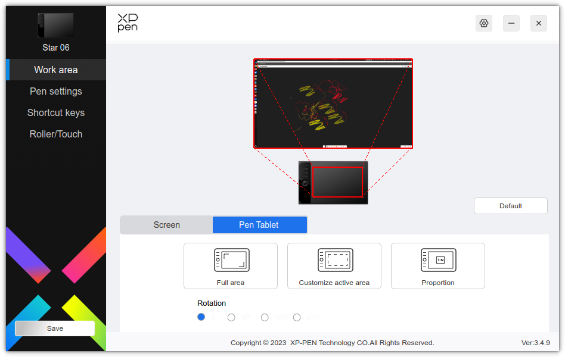
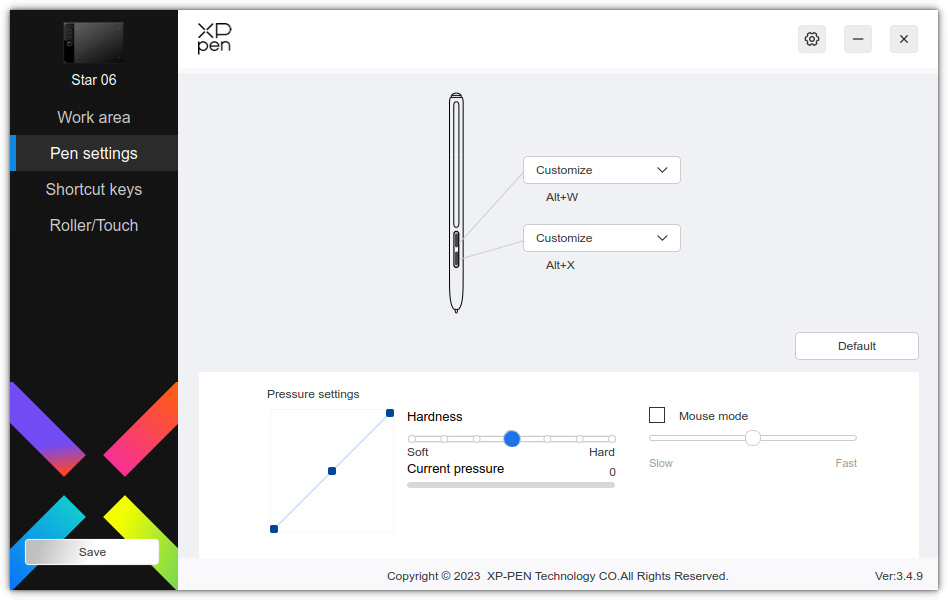
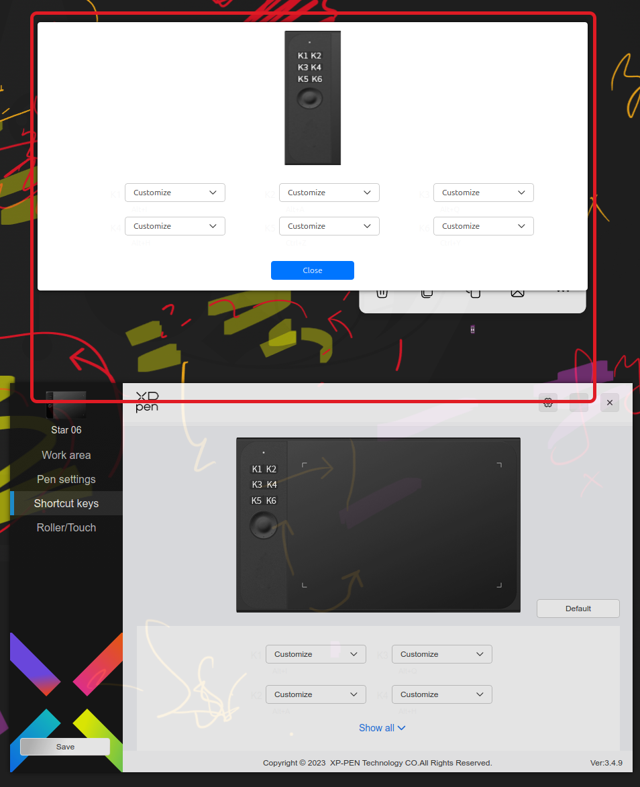
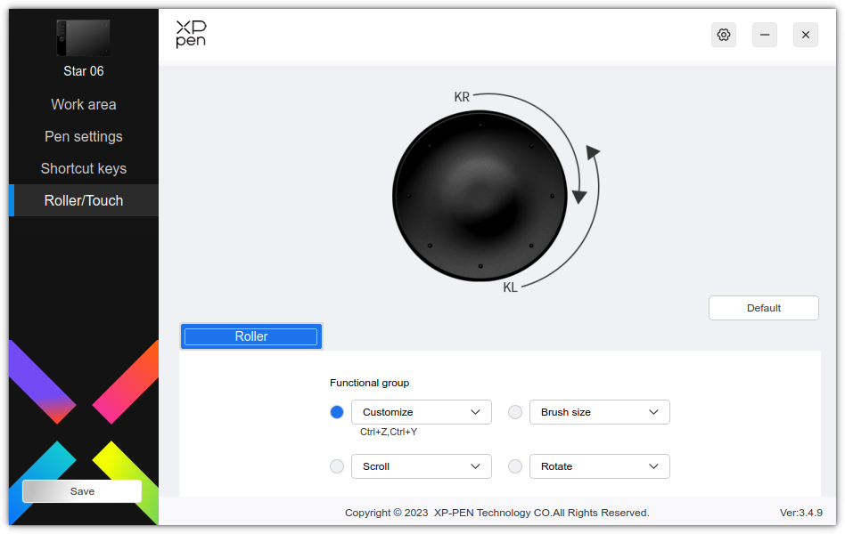

# XP Pen tablet config for MS Whiteboard

## Drivers download page: <https://www.xp-pen.com/download/star-06.html>

# Automatic import

In driver config menu, wheel -> Import settings -> import the file ./win_dotfiles/PenTablet_Config_2025-05-14.pcfg

# Manual import

## Pen settings

Key              |  Shortcut  | MS Whiteboard tool
-----------------|------------|--------------------
Top button       | Alt+W      | *Switch to pen*
Bottom button    | Alt+X      | *Ereaser*

## Roller settings

Undo/Redo - (Ctrl-Z, Ctrl-Y)

## Shortcut keys

Key |  Shortcut  | MS Whiteboard tool
----|------------|--------------------
K1  |  Alt+I     | *Highliter*
K2  |  Alt+A     | *Arrow*
K3  |  Alt+Q     | *Lasso*
K4  |  Alt+S     | *Select*
K5  |  Ctrl+Z    | *Undo*
K6  |  Ctrl+Y    | *Redo*

## Screenshots of the settings

### XP-Pen driver settings

### MS Whiteboard - most often used pen colors

## Notes

MS Whiteboard on Linux & Chrome works fine, while on Linux & Firefox, the app does not register pen pressure (the pressure is constant).
